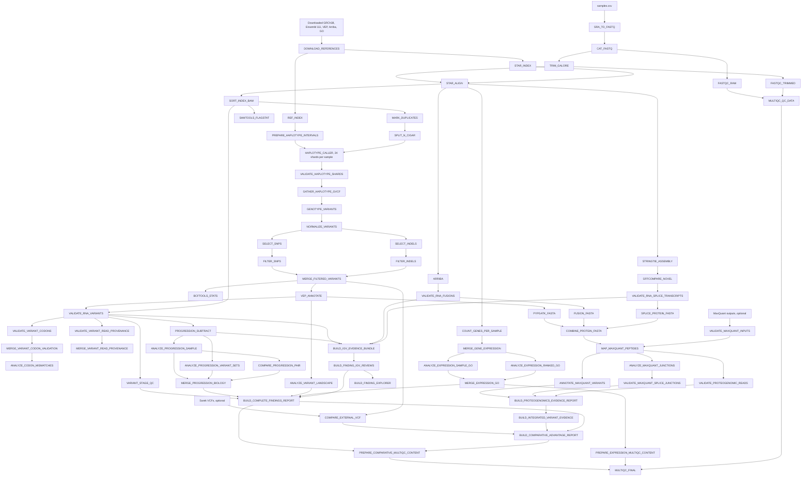

# PGTK Minimal Production Pipeline

PGTK is a production-oriented Nextflow DSL2 workflow for RNA-seq quality control, alignment, expression analysis, RNA-observed variant calling, fusion and splice analysis, longitudinal progression comparison, GO enrichment, exploratory proteogenomic FASTA generation, IGV evidence packaging, and integrated reporting.

This repository intentionally contains only the files required to download runtime assets, validate the exact execution environment, run the production workflow, generate reports, and serve the database-free finding explorer. Historical update notes, retired utilities, test fixtures, example MaxQuant XML files, lane-splitting experiments, coverage plotting scripts, and one-off analysis scripts were removed from the minimal production tree.

## Important interpretation limits

PGTK analyzes RNA-derived evidence. RNA-observed variants are not automatically DNA-confirmed somatic variants. A candidate may be affected by RNA editing, allele-specific expression, mapping ambiguity, transcript structure, sequencing error, or germline variation. The pipeline keeps candidate generation separate from strict RNA read, codon, provenance, and optional proteomics validation.

Sarek comparison and MaxQuant validation are optional integrations. PGTK does not download or run Sarek or MaxQuant. PGTK consumes their existing outputs when the corresponding optional branch is enabled.

## Validated production run

The minimal repository was validated on Saga with:

```text
Nextflow: 26.04.6
Scheduler: Slurm
Container runtime: Apptainer
Reference assembly: GRCh38
Ensembl release: 111
VEP cache: release 111, GRCh38
Pipeline processes declared: 73
Validated containers: 18
Required downloaded reference assets: 8
```

A complete clean run using samples TK12, TK13, and TK14 finished successfully with 209 executed tasks, zero failed tasks, and zero retries.

## Repository layout

The authoritative source manifest is `pipeline_required_files.txt`. Source validation stops before launch if a listed file is missing or empty.

### Pipeline orchestration and configuration

| File | Purpose |
|---|---|
| `main.nf` | Complete 73-process Nextflow DSL2 workflow, channel construction, process definitions, optional branch wiring, parameter validation, output publication, and final report assembly. |
| `nextflow.config` | Slurm executor configuration, robust retry behavior, queue routing, resource escalation, task-specific CPU, memory, and time directives, trace, report, timeline, and DAG settings. |
| `scratch.slurm` | Production Slurm wrapper. Resolves paths and environment variables, creates runtime directories, loads Java when configured, runs source and runtime preflight validation, launches Nextflow with Apptainer and `-resume`, writes execution reports, and runs post-execution failure and resource analysis. |
| `run.sh` | Lightweight direct Nextflow launcher for environments where the full Slurm wrapper is not required. Production Saga runs should use `scratch.slurm`. |
| `samples.csv` | Input samplesheet containing sample, SRA accession, subject identifier, group metadata, and baseline designation. |
| `multiqc_config.yaml` | MultiQC title, module order, filename cleanup, table limits, and report interpretation text. |
| `PIPELINE_VALIDATION_SEMANTICS.md` | Definitions for codon validation, partial evidence, validation failure, strict integrated evidence, and resource-profile semantics. |
| `pipeline_required_files.txt` | Exact manifest of files required in the minimal production source tree. |
| `.gitattributes` | Git attribute rules for repository files. |
| `.gitignore` | Excludes generated results, runtime caches, downloaded assets, logs, work directories, and temporary files. |
| `LICENSE` | Repository license. |

### Download and validation tools

| File | Purpose |
|---|---|
| `download_assets.sh` | Creates asset directories, downloads 18 pinned Apptainer images and eight required reference assets, validates archives and images, and writes SHA-256 manifests. It does not download UniProt because the core pipeline does not consume it. |
| `download_sra.sh` | Reads SRA accessions from `samples.csv`, creates `sra_cache`, downloads each archive on a login node using the pinned SRA Tools image, and validates every archive using `vdb-validate`. |
| `validate_pipeline_commands.sh` | Source preflight. Checks the manifest, Python and shell syntax, 73 unique process declarations, required wiring, Apptainer use, Pysam contracts, and `nextflow inspect`. |
| `validate_runtime_inputs.py` | Exact runtime preflight. Checks directories, executables, eight references, 18 images and tools, Python scripts inside their target images, all SRA archives, optional Sarek and MaxQuant inputs, and Nextflow inspection. |
| `collect_pipeline_failures.py` | Builds a per-run failure ledger and cumulative failure history from the trace, Nextflow log, wrapper log, task attempts, and final exit code. |
| `analyze_pipeline_trace.py` | Summarizes task runtime, CPU, memory, resource efficiency, retries, and warning conditions from the Nextflow trace. |

### Variant, RNA, codon, and provenance analysis

| File | Purpose |
|---|---|
| `validate_haplotype_shards.py` | Confirms that every expected scattered HaplotypeCaller shard produced a valid GVCF before gathering. |
| `summarize_variant_stages.py` | Summarizes raw, normalized, hard-filtered, annotated, and RNA-validated variant stages for QC and reporting. |
| `validate_rna_events.py` | Performs sample-matched RNA support checks for variants, fusions, and splice events using indexed alignments. |
| `validate_variant_codons.py` | Compares genome reference, VEP consequence, codon translation, and sample-matched RNA evidence to classify codon-level validation. |
| `validate_variant_read_provenance.py` | Classifies variant-supporting reads, reference reads, non-callable reads, mapping quality, base quality, callable depth, and ALT fraction. |
| `merge_variant_validation.py` | Merges per-sample codon and validation tables into consolidated outputs. |
| `analyze_codon_mismatches.py` | Investigates reference, alternate, transcript, and translation disagreements reported during codon validation. |
| `build_integrated_variant_evidence.py` | Integrates variant, RNA, codon, provenance, and optional peptide evidence into a consolidated evidence table. |
| `compare_external_vcf.py` | Optional Sarek comparison. Compares one indexed external VCF per SRA accession against PGTK raw, filtered, and RNA-validated calls. |

### Expression, progression, and GO analysis

| File | Purpose |
|---|---|
| `prepare_go_annotations.py` | Parses GO ontology and human GAF data into normalized gene-to-term, term metadata, namespace, and background files. |
| `expression_go_analysis.py` | Performs per-sample expression ORA and ranked GO analysis for baseline comparisons using the merged expression matrix. |
| `analyze_progression_biology.py` | Converts baseline-subtracted variants into per-sample progression allele, gene, and GO enrichment summaries. |
| `compare_progression_pair.py` | Creates pairwise progression comparisons between non-baseline samples from the same subject. |
| `merge_progression_biology.py` | Consolidates per-sample, pairwise, and set-level progression results into final tables and a report. |
| `analyze_variant_landscape.py` | Summarizes variant classes, consequences, nonsynonymous genes, and variant-associated GO enrichment. |

### Proteogenomics and MaxQuant integration

| File | Purpose |
|---|---|
| `map_peptides_to_fasta.py` | Maps MaxQuant peptide sequences to PGTK custom proteins, the exact canonical FASTAs recorded in `mqpar.xml`, and contaminants. |
| `annotate_variant_peptides.py` | Connects variant-derived peptides to variants, altered residues, protein annotations, and reference-proteome checks. |
| `analyze_chimeric_splice_peptides.py` | Classifies peptide evidence for fusion and novel splice proteins. |
| `validate_splice_junction_peptides.py` | Validates splice-derived peptides against the relevant transcript junction sequence. |
| `validate_proteogenomic_reads.py` | Uses the pinned Pysam image to validate reads supporting peptide-linked genomic and transcript events without an external `samtools` command. |
| `proteogenomics_evidence_report.py` | Builds the optional integrated MaxQuant proteogenomics evidence report. |
| `maxquant_raw_file_map.none.tsv` | Empty, schema-valid sentinel used when no explicit MaxQuant raw-file-to-sample map is supplied. |

### Reporting, IGV, and explorer generation

| File | Purpose |
|---|---|
| `build_igv_evidence_bundle.py` | Builds BED or BEDPE coordinates, indexed event-specific BAMs, IGV batch files, IGV sessions, and event-to-sample manifests for RNA and progression evidence. |
| `build_finding_igv_reviews.py` | Consolidates findings, selects event regions, classifies reads, builds event evidence BAMs, and prepares strict finding review manifests. |
| `build_finding_explorer.py` | Creates the portable database-free HTML finding explorer and its data assets. |
| `serve_finding_explorer.sh` | Serves the generated explorer over a local HTTP port, suitable for SSH port forwarding. |
| `build_compact_multiqc_content.py` | Converts core pipeline findings into compact MultiQC custom-content sections. |
| `build_expression_multiqc_content.py` | Converts expression and GO summaries into MultiQC custom content. |
| `build_pgtk_multiqc_content.py` | Produces integrated PGTK-specific MultiQC content and summary tables. |
| `build_complete_report.py` | Builds the complete findings report across variants, fusions, splice events, progression, expression, GO, and validation evidence. |
| `build_comparative_advantage_report.py` | Builds the comparative biological-advantage report, including branch availability and evidence interpretation. |
| `external_comparison.none.tsv` | Empty, schema-valid sentinel used when external Sarek comparison is disabled. |

## Removed files

1. Historical implementation and update notes, now superseded by this README, `PIPELINE_VALIDATION_SEMANTICS.md`, Git history, and generated execution reports.
2. Retired one-off analysis scripts, coverage plotting tools, lane-splitting utilities, and manual VEP helpers that are not referenced by `main.nf` or the production wrappers.
3. Example or local data files such as `mqpar.xml`, `callparam.xml`, ENA URL lists, extraction summaries, and alternate samplesheets. These must not be shipped as production defaults.
4. Development tests and fixture validators. These were used during redesign but are not runtime dependencies of the minimal production tree.
5. Old run instructions that are superseded by the complete procedure below.

## Pipeline architecture



## End-to-end Saga run procedure

### 1. Clone or enter the minimal repository

```bash
cd /cluster/projects/nn9036k/scrbkup/PGTK-minimal-audited
```

Confirm the exact source set:

```bash
find . -maxdepth 1 -type f -printf '%f\n' | sort | wc -l

comm -3 \
  <(sort pipeline_required_files.txt) \
  <(find . -maxdepth 1 -type f \
      ! -name pipeline_required_files.txt \
      -printf '%f\n' | sort)
```

Expected file count: `50`. The `comm` command must produce no output.

### 2. Configure the samplesheet

The minimum required columns are:

```csv
sample,srr
```

For progression analysis, use:

```csv
sample,srr,TK,Group,baseline
TK12,SRR31089074,patient1,resistant,true
TK13,SRR31089073,patient1,sensitive,false
TK14,SRR31089072,patient1,sensitive,false
```

Field meanings:

- `sample`: unique pipeline sample name.
- `srr`: unique SRA run accession.
- `TK`: subject or patient identifier used to group longitudinal samples.
- `Group`: descriptive metadata retained in outputs.
- `baseline`: exactly one `true` sample per subject when progression subtraction is required. Values must be `true` or `false`.

### 3. Define runtime locations

```bash
export PROJECT_DIR="$PWD"
export CONTAINER_CACHE="$PROJECT_DIR/singularity_cache"
export REFERENCE_DOWNLOADS="$PROJECT_DIR/reference_downloads"
export SRA_DIR="$PROJECT_DIR/sra_cache"
export RESULTS_DIR="$PROJECT_DIR/results"

export WORK_DIR=/cluster/work/users/ash022/pgtk-work
export TMP_ROOT=/cluster/work/users/ash022/pgtk-tmp
export NXF_HOME_DIR="$PROJECT_DIR/.nextflow_home"

export NEXTFLOW="$HOME/bin/nextflow"
export HOST_PYTHON="$(command -v python3)"
export APPTAINER="$(command -v apptainer)"

mkdir -p \
  "$CONTAINER_CACHE" \
  "$REFERENCE_DOWNLOADS" \
  "$SRA_DIR" \
  "$RESULTS_DIR" \
  "$WORK_DIR" \
  "$TMP_ROOT" \
  "$NXF_HOME_DIR"
```

Check storage:

```bash
df -h "$PROJECT_DIR" "$WORK_DIR"
df -i "$PROJECT_DIR" "$WORK_DIR"
```

### 4. Download containers and references

Run on a Saga login node. Do not submit internet-dependent downloads through Slurm.

```bash
cd "$PROJECT_DIR"

bash download_assets.sh "$PROJECT_DIR" 2>&1 |
tee "download_assets_$(date +%Y%m%d_%H%M%S).log"
```

The script creates the required cache and temporary directories and downloads:

```text
18 Apptainer images
GRCh38 primary assembly FASTA
Ensembl 111 GTF
Ensembl 111 cDNA FASTA
Ensembl 111 peptide FASTA
VEP 111 GRCh38 cache
Arriba 2.4.0 resources
GO basic ontology
Human GO annotations
```

Expected final message:

```text
All 18 containers and all 8 reference assets are valid.
```

Set downloaded paths:

```bash
export PYSAM_IMAGE="$CONTAINER_CACHE/quay.io-biocontainers-pysam-0.24.0--py312hf5ad864_1.img"
export ENSEMBL_PEP="$REFERENCE_DOWNLOADS/Homo_sapiens.GRCh38.pep.all.fa.gz"
```

Verify checksums:

```bash
cd "$REFERENCE_DOWNLOADS"
sha256sum -c downloaded_assets.sha256

cd "$CONTAINER_CACHE"
sha256sum -c downloaded_containers.sha256

cd "$PROJECT_DIR"
```

### 5. Download and validate SRA archives

Run on a Saga login node, never through Slurm.

```bash
cd "$PROJECT_DIR"

bash download_sra.sh "$PROJECT_DIR" 2>&1 |
tee "download_sra_$(date +%Y%m%d_%H%M%S).log"
```

The script reads `samples.csv`, creates one directory per accession, and stores:

```text
sra_cache/<SRR>/<SRR>.sra
```

Every archive must pass `vdb-validate`.

```bash
find "$SRA_DIR" \
  -type f \
  -name '*.sra' \
  -printf '%s\t%p\n' |
sort
```

### 6. Run source validation

```bash
cd "$PROJECT_DIR"

bash validate_pipeline_commands.sh \
  --project-dir "$PROJECT_DIR" \
  --nextflow "$NEXTFLOW" \
  --python "$HOST_PYTHON"
```

Required ending:

```text
FAIL: 0
RESULT: PASSED
```

### 7. Run complete runtime validation

For the first core run, keep optional Sarek and MaxQuant branches disabled:

```bash
"$HOST_PYTHON" -u validate_runtime_inputs.py \
  --project-dir "$PROJECT_DIR" \
  --reference-downloads "$REFERENCE_DOWNLOADS" \
  --container-cache "$CONTAINER_CACHE" \
  --sra-dir "$SRA_DIR" \
  --samplesheet "$PROJECT_DIR/samples.csv" \
  --work-dir "$WORK_DIR" \
  --tmp-root "$TMP_ROOT" \
  --results-dir "$RESULTS_DIR" \
  --host-python "$HOST_PYTHON" \
  --apptainer "$APPTAINER" \
  --pysam-image "$PYSAM_IMAGE" \
  --nextflow "$NEXTFLOW" \
  -- \
  --run_external_vcf_comparison false \
  --run_proteogenomic_validation false \
  2>&1 | tee "runtime_validation_$(date +%Y%m%d_%H%M%S).log"
```

Required ending:

```text
PASS: COMPLETE PRE-SUBMISSION RUNTIME VALIDATION
PASS: 18 exact containers and required executables
PASS: 8 required reference assets
PASS: all samples and vdb-validated SRA archives
PASS: enabled optional branches and exact inputs
```

### 8. Submit the initial core pipeline

```bash
cd "$PROJECT_DIR"

JOB_ID=$(
  sbatch \
    --parsable \
    --account=nn9036k \
    --partition=normal \
    --export=ALL,\
PGTK_ACCOUNT=nn9036k,\
PGTK_NORMAL_PARTITION=normal,\
PGTK_BIGMEM_PARTITION=bigmem,\
PGTK_PROJECT_DIR="$PROJECT_DIR",\
PGTK_WORK_DIR="$WORK_DIR",\
PGTK_TMP_ROOT="$TMP_ROOT",\
PGTK_NXF_HOME="$NXF_HOME_DIR",\
PGTK_CONTAINER_CACHE="$CONTAINER_CACHE",\
PGTK_PYSAM_IMAGE="$PYSAM_IMAGE",\
PGTK_SRA_DIR="$SRA_DIR",\
PGTK_REFERENCE_DOWNLOADS="$REFERENCE_DOWNLOADS",\
PGTK_SAMPLESHEET="$PROJECT_DIR/samples.csv",\
PGTK_RESULTS_DIR="$RESULTS_DIR",\
PGTK_NEXTFLOW="$NEXTFLOW",\
PGTK_PYTHON="$HOST_PYTHON",\
PGTK_APPTAINER="$APPTAINER",\
PGTK_JAVA_MODULE=Java/21,\
PGTK_SLURM_LOG_TEMPLATE="$PROJECT_DIR/pgtk-wrapper-{job_id}.log" \
    scratch.slurm \
    -- \
    --run_external_vcf_comparison false \
    --run_proteogenomic_validation false
)

printf '%s\n' "$JOB_ID" | tee "$PROJECT_DIR/.pgtk_current_job_id"
printf 'JOB_ID=%s\n' "$JOB_ID"
```

The wrapper automatically repeats source and runtime validation before launching Nextflow.

### 9. Monitor execution

```bash
cd "$PROJECT_DIR"
JOB_ID=$(cat .pgtk_current_job_id)

until [[ -f "pgtk-wrapper-${JOB_ID}.log" ]]; do
  sleep 2
done

tail -F "pgtk-wrapper-${JOB_ID}.log"
```

In another terminal:

```bash
squeue -j "$JOB_ID" \
  -o '%.18i %.12P %.35j %.10T %.10M %.10l %R'

squeue -u ash022 \
  -o '%.18i %.12P %.40j %.10T %.10M %.10l %R'
```

After completion:

```bash
sacct -j "$JOB_ID" \
  --format=JobID,JobName,State,ExitCode,Elapsed,AllocCPUS,ReqMem,MaxRSS
```

Check the trace:

```bash
TRACE="$RESULTS_DIR/pipeline_trace-${JOB_ID}.tsv"

awk -F '\t' \
  'NR == 1 || ($4 != "COMPLETED" && $4 != "CACHED")' \
  "$TRACE"
```

A successful run prints only the header.

### 10. Principal outputs

```text
results/multiqc/multiqc_report.html
results/combined_fasta/<sample>.exploratory_proteogenomics.fasta
results/progression_vcf/
results/progression_biology/
results/expression/
results/variant_landscape/
results/igv/
results/complete_findings/
results/comparative_report/
results/pipeline_trace-<job_id>.tsv
results/pipeline_report-<job_id>.html
results/pipeline_timeline-<job_id>.html
results/pipeline_dag-<job_id>.html
results/resource_usage-<job_id>.*
results/failure_logs/
```

## Optional Sarek comparison

PGTK does not run Sarek. Supply existing indexed VCFs. The runtime validator requires exactly one matching VCF and `.tbi` per samplesheet SRA accession.

```bash
export SAREK_DIR=/path/to/sarek/variant_calling/haplotypecaller
```

Enable during validation and submission:

```bash
--run_external_vcf_comparison true \
--external_vcf_dir "$SAREK_DIR" \
--external_vcf_suffix '.haplotypecaller.filtered.vcf.gz'
```

## Optional MaxQuant proteogenomics validation

A fresh analysis uses two PGTK phases:

1. Run PGTK with MaxQuant validation disabled to generate sample-specific exploratory proteogenomic FASTAs.
2. Run MaxQuant externally using the PGTK custom FASTAs, the selected canonical human FASTA, and contaminants.
3. Resume PGTK with MaxQuant validation enabled.

Expected MaxQuant input directory:

```text
peptides.txt
evidence.txt
msms.txt
proteinGroups.txt
```

Also supply `mqpar.xml` and the contaminants FASTA used in the search.

```bash
--run_proteogenomic_validation true \
--maxquant_txt /path/to/combined/txt \
--maxquant_mqpar /path/to/mqpar.xml \
--maxquant_contaminants /path/to/contaminants.fasta
```

PGTK resolves canonical FASTAs from the exact paths recorded in `mqpar.xml`. The separately downloaded Ensembl peptide FASTA is used for reference-peptide annotation. No UniProt file is downloaded by `download_assets.sh`.

## Finding explorer

Start the generated explorer on Saga:

```bash
cd "$RESULTS_DIR/igv/findings/finding_explorer"
export PGTK_IGV_REPORTS_IMAGE="$CONTAINER_CACHE/quay.io-biocontainers-igv-reports-1.16.0--pyh7e72e81_0.img"
./serve_explorer.sh "$PWD" 8765
```

Open:

```text
http://127.0.0.1:8765
```
## License

See `LICENSE`.

