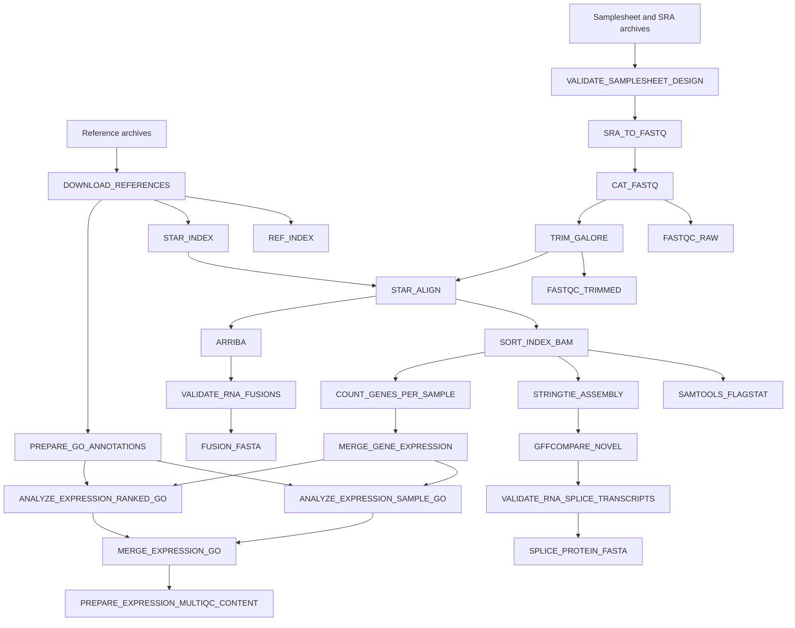
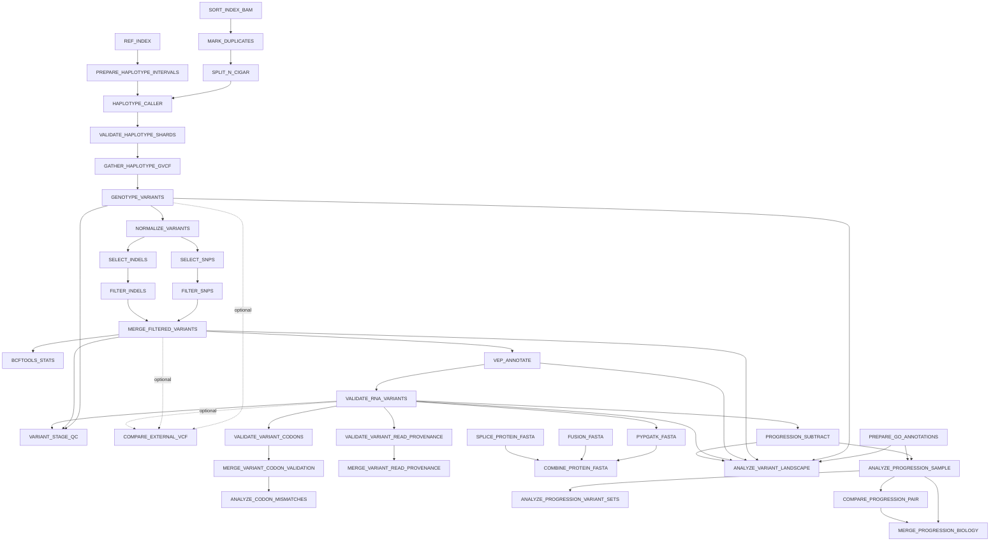
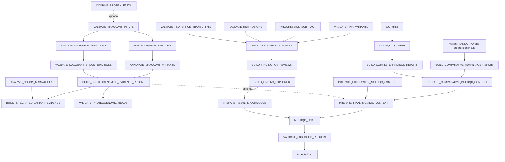

# PGTK Production Pipeline

PGTK is a Nextflow DSL2 workflow for RNA-seq quality control, alignment, expression analysis, RNA-observed variant calling, fusion and splice analysis, longitudinal baseline comparison, GO enrichment, exploratory proteogenomic FASTA generation, IGV evidence review, optional external-VCF comparison, optional MaxQuant evidence integration, consolidated reporting, and exhaustive final validation.

The repository is intentionally flat. Pipeline code, helper programs, validators, tests, configuration, and documentation are stored in the repository root.

## Interpretation limits

PGTK analyzes RNA-derived evidence. RNA-observed variants are not automatically DNA-confirmed somatic variants. RNA editing, germline variation, allele-specific expression, mapping ambiguity, transcript structure, library artifacts, and sequencing errors remain possible explanations. VEP impact describes the candidate allele, not read-validation strength.

PGTK does not run Sarek or MaxQuant. Optional branches consume completed outputs from those tools. PGTK output is research evidence and is not a clinical interpretation.

## Architecture

The current source defines 76 unique Nextflow processes. Every process is represented in the diagrams below. Solid arrows show principal data flow. Dashed arrows show optional or reporting dependencies.

### Input, QC, alignment, expression, fusion, and splice branches



### Variant calling, validation, FASTA, progression, and biology



### IGV, reports, optional proteogenomics, MultiQC, and acceptance



`VALIDATE_SAMPLESHEET_DESIGN` runs before sample processing. `VALIDATE_PUBLISHED_RESULTS` runs after `MULTIQC_FINAL`, uses `errorStrategy 'terminate'`, and determines final workflow acceptance.

## Samplesheet

Required columns are `sample` and `srr`. `TK`, `Group`, and `baseline` are supported metadata.

```csv
sample,srr,TK,Group,baseline
SAMPLE_A,SRR000001,SUBJECT_1,baseline_group,true
SAMPLE_B,SRR000002,SUBJECT_1,followup_group,false
```

Rules:

- `sample` and `srr` must be non-empty and unique.
- `TK` is the subject identifier and defaults to `sample`.
- `Group` is descriptive metadata and defaults to `sample`.
- `baseline` must be `true` or `false`.
- Exactly one baseline per `TK` enables subtraction.
- No baseline is reported as `SKIPPED_NO_BASELINE`.
- Multiple baselines for one `TK` terminate the workflow.
- Per-sample protein FASTAs are never baseline-subtracted.

The normalized design report is published to `results/qc/samplesheet/samplesheet_design.tsv`.

## Saga quick start

Download scripts require internet access. Run them directly on a Saga login node, never through Slurm compute nodes.

```bash
git clone https://github.com/animesh/PGTK
cd PGTK
bash download_assets.sh
bash download_sra.sh
```

Declare runtime values:

```bash
DATA_ROOT=$PWD
WORK_ROOT=$WORK
PYTHON_PATH=/cluster/software/Mamba/4.14.0-0/bin/python3
APPTAINER_PATH=/usr/bin/apptainer
SLURM_ACCOUNT=nn9036k
NF_PATH=/cluster/home/ash022/bin/nextflow
PART_NORM=normal
PART_BIG=bigmem
module load Java/21.0.2
```

Validate the source with the real Saga executables:

```bash
bash validate_pipeline_commands.sh \
  --project-dir "$PWD" \
  --nextflow "$NF_PATH" \
  --python "$PYTHON_PATH"
```

Required ending:

```text
FAIL: 0
RESULT: PASSED
```

## Preflight-only submission

```bash
PREFLIGHT_JOB_ID=$(sbatch --parsable \
  --account="$SLURM_ACCOUNT" \
  scratch.slurm \
  --preflight-only \
  --account "$SLURM_ACCOUNT" \
  --normal-partition "$PART_NORM" \
  --bigmem-partition "$PART_BIG" \
  --project-dir "$PWD" \
  --work-dir "$WORK_ROOT/pgtk-work" \
  --results-dir "$DATA_ROOT/results" \
  --reference-downloads "$DATA_ROOT/reference_downloads" \
  --container-cache "$DATA_ROOT/singularity_cache" \
  --sra-dir "$DATA_ROOT/sra_cache" \
  --tmp-root "$WORK_ROOT/pgtk-tmp" \
  --nxf-home "$DATA_ROOT/.nextflow_home" \
  --samplesheet "$DATA_ROOT/samples.csv" \
  --ensembl-pep "$DATA_ROOT/reference_downloads/Homo_sapiens.GRCh38.pep.all.fa.gz" \
  --pysam-image "$DATA_ROOT/singularity_cache/quay.io-biocontainers-pysam-0.24.0--py312hf5ad864_1.img" \
  --nextflow "$NF_PATH" \
  --python "$PYTHON_PATH" \
  --apptainer "$APPTAINER_PATH" \
  --java-module Java/21.0.2 \
  --slurm-log-template "$PWD/pgtk-wrapper-{job_id}.log" \
  --)
printf '%s\n' "$PREFLIGHT_JOB_ID" | tee .pgtk_current_preflight_job_id
tail -F "pgtk-wrapper-${PREFLIGHT_JOB_ID}.log"
```

Required ending:

```text
PASS: COMPLETE PRE-SUBMISSION RUNTIME VALIDATION
PASS: preflight-only mode completed; Nextflow was not launched
```

## Production submission and resume

`scratch.slurm` always launches Nextflow with `-resume`.

```bash
JOB_ID=$(sbatch --parsable \
  --account="$SLURM_ACCOUNT" \
  scratch.slurm \
  --account "$SLURM_ACCOUNT" \
  --normal-partition "$PART_NORM" \
  --bigmem-partition "$PART_BIG" \
  --project-dir "$PWD" \
  --work-dir "$WORK_ROOT/pgtk-work" \
  --results-dir "$DATA_ROOT/results" \
  --reference-downloads "$DATA_ROOT/reference_downloads" \
  --container-cache "$DATA_ROOT/singularity_cache" \
  --sra-dir "$DATA_ROOT/sra_cache" \
  --tmp-root "$WORK_ROOT/pgtk-tmp" \
  --nxf-home "$DATA_ROOT/.nextflow_home" \
  --samplesheet "$DATA_ROOT/samples.csv" \
  --ensembl-pep "$DATA_ROOT/reference_downloads/Homo_sapiens.GRCh38.pep.all.fa.gz" \
  --pysam-image "$DATA_ROOT/singularity_cache/quay.io-biocontainers-pysam-0.24.0--py312hf5ad864_1.img" \
  --nextflow "$NF_PATH" \
  --python "$PYTHON_PATH" \
  --apptainer "$APPTAINER_PATH" \
  --java-module Java/21.0.2 \
  --slurm-log-template "$PWD/pgtk-wrapper-{job_id}.log" \
  --)
printf '%s\n' "$JOB_ID" | tee .pgtk_current_job_id
tail -F "pgtk-wrapper-${JOB_ID}.log"
```

## Integrated final validation

The default final process is `VALIDATE_PUBLISHED_RESULTS` with 32 workers, 256 GB memory, 24 hours, bigmem routing, all-findings selection, and terminating failure behavior. It validates source/runtime provenance, trace states, declared processes, published arithmetic, VCFs/indexes, BAMs/indexes/CIGAR identities, IGV resources, raw VCF publication, per-sample non-subtracted FASTAs, progression reports, explorer integrity, MultiQC/catalogue integrity, FASTA structure, and report/archive checksums.

Outputs:

```text
results/validation/PGTK-complete-validation-<job-id>/
results/validation/PGTK-complete-validation-<job-id>.tar.gz
results/validation/PGTK-complete-validation-<job-id>.tar.gz.sha256
results/validation/PGTK-deep-audit-<job-id>/
results/validation/PGTK-deep-audit-<job-id>.tar.gz
results/validation/PGTK-deep-audit-<job-id>.tar.gz.sha256
```

A run is accepted only when Nextflow exits successfully, complete validation reports `Overall: PASS`, deep audit reports `ERROR: 0`, and archive checksum verification succeeds.

## Independent local results audit

`audit_pgtk_results.py` performs a separate read-only audit of a completed `results/` tree. It inventories and hashes results; validates gzip/tar, checksum manifests, tabular files, JSON, XML, VCF/index pairs, BAM/index pairs, BED/BEDPE coordinates, trace states, logs, source syntax, failure ledgers, and final validation archives; then creates a shareable report bundle.

The auditor discovers `samtools` through `PATH`. To use the pinned Pysam 0.24.0 container and its embedded samtools 1.23.1 implementation, create this temporary wrapper:

```bash
cd PGTK
AUDIT_BIN=$(mktemp -d /cluster/work/users/ash022/pgtk-pysam-audit.XXXXXX)
cat > "${AUDIT_BIN}/samtools" <<'EOF'
#!/usr/bin/env bash
set -euo pipefail
PYSAM_IMAGE="PGTK/singularity_cache/quay.io-biocontainers-pysam-0.24.0--py312hf5ad864_1.img"
if [[ "${1:-}" != "quickcheck" ]]; then
    echo "This wrapper supports only: samtools quickcheck" >&2
    exit 2
fi
shift
exec /usr/bin/apptainer exec \
  --bind PGTK \
  "$PYSAM_IMAGE" \
  python3 -c '
import sys
import pysam
try:
    pysam.samtools.quickcheck(*sys.argv[1:], catch_stdout=False)
except pysam.utils.SamtoolsError as exc:
    print(exc, file=sys.stderr)
    raise SystemExit(1)
' "$@"
EOF
chmod 755 "${AUDIT_BIN}/samtools"
```

Run the validator. Replace `19715562` for another run:

```bash
PATH="${AUDIT_BIN}:${PATH}" /cluster/software/Mamba/4.14.0-0/bin/python3 \
  audit_pgtk_results.py \
  --project-dir PGTK \
  --results-dir PGTK/results \
  --job-id 19715562 \
  --output-dir PGTK \
  --hash-large-files
rm -rf "${AUDIT_BIN}"
sha256sum -c PGTK-independent-audit-19715562.tar.gz.sha256
```

Outputs:

```text
PGTK-independent-audit-<job-id>/REPORT.md
PGTK-independent-audit-<job-id>/checks.tsv
PGTK-independent-audit-<job-id>/summary.json
PGTK-independent-audit-<job-id>/results_inventory.tsv
PGTK-independent-audit-<job-id>/results_checksums.sha256
PGTK-independent-audit-<job-id>/audit_bundle_checksums.sha256
PGTK-independent-audit-<job-id>.tar.gz
PGTK-independent-audit-<job-id>.tar.gz.sha256
```

### Verified production run 19715562

Independent verification on 3 September 2026 produced:

```text
Source preflight: 146 PASS, 0 FAIL
Runtime preflight: PASS
Nextflow tasks: 211 CACHED, 1 COMPLETED, 0 FAILED, 0 ABORTED
Current failure ledger rows: 0
Result files: 722
Result size: 54.3 GiB
Result files hashed: 722/722
Audit checks: 656 PASS, 1 WARN, 0 FAIL
Pysam/samtools BAM quickchecks: 18/18 PASS
Audit bundle SHA-256: 352b70f46d452a14dde9f04215ac23176efc95c1ac57748618a4ef2d9b9b584c
```

## Optional external VCF comparison

Add the external root as a wrapper bind before `--`, then enable the branch after `--`:

```bash
--bind-path /path/to/external_vcfs \
-- \
--run_external_vcf_comparison true \
--external_vcf_dir /path/to/external_vcfs \
--external_vcf_suffix .haplotypecaller.filtered.vcf.gz
```

Exactly one indexed `<SRR><suffix>` file must exist per samplesheet accession.

## Optional MaxQuant validation

Run PGTK first with the branch disabled, search the published sample FASTAs externally, then resume with:

```bash
--bind-path /path/to/maxquant/txt \
--bind-path /path/to/mqpar_parent \
--bind-path /path/to/contaminants_parent \
-- \
--run_proteogenomic_validation true \
--maxquant_txt /path/to/maxquant/txt \
--maxquant_mqpar /path/to/mqpar.xml \
--maxquant_contaminants /path/to/contaminants.fasta
```

Required inputs are `peptides.txt`, `evidence.txt`, `msms.txt`, `proteinGroups.txt`, `mqpar.xml`, searched FASTAs, and the contaminants FASTA.

## Finding Explorer

The explorer is published under `results/igv/findings/finding_explorer/`. Set the pinned images and launch from the project root:

```bash
export PGTK_PYSAM_IMAGE="$DATA_ROOT/singularity_cache/quay.io-biocontainers-pysam-0.24.0--py312hf5ad864_1.img"
export PGTK_IGV_REPORTS_IMAGE="$DATA_ROOT/singularity_cache/quay.io-biocontainers-igv-reports-1.16.0--pyh7e72e81_0.img"
bash serve_finding_explorer.sh "$DATA_ROOT/results/igv/findings/finding_explorer" 8765
```

The server extracts event-specific BAMs from exact identities in `display_alignment_manifest.tsv.gz`. Sample-wide display BAMs are storage pools only.

## Core defaults

```text
HaplotypeCaller shards: 24
Calling confidence: 20
RNA minimum depth: 10
RNA minimum ALT reads: 3
RNA minimum ALT fraction: 0.05
Finding MAPQ: 20
Finding base quality: 20
Reference display cap: 20
ALT display cap: 100
Splice minimum coverage: 2.5
Splice minimum junction reads: 3
GO set size: 10 to 500
GO FDR: 0.1
Final validation workers: 32
Final validation memory: 256 GB
Final validation time: 24h
```

## Evidence arithmetic

```text
CallableAlignments = ExactAltReads + CleanReferenceReads
UniqueAlignments = CallableAlignments + ExcludedReads
ALT fraction among callable = ExactAltReads / CallableAlignments
```

When callable depth is zero, ALT fraction must be null or `NA`. Coordinate overlap alone is not ALT evidence.

## Principal outputs

```text
results/qc/
results/bam/star/
results/gvcf/
results/vcf_raw/
results/vcf_normalized/
results/vcf_snp/
results/vcf_indel/
results/vcf_filtered/
results/vcf_pass/
results/vep/
results/rna_validation/
results/progression_vcf/
results/progression_biology/
results/expression/
results/variant_landscape/
results/variant_fasta/
results/fusion_fasta/
results/splice_fasta/
results/combined_fasta/
results/igv/
results/reports/
results/comparison/external_vcf/
results/proteogenomics_validation/
results/comparative_advantage/
results/multiqc/
results/validation/
results/failure_logs/
```

## Repository file catalogue

The following files are expected in the flat repository root. `pipeline_required_files.txt` is the authoritative machine-readable manifest and must be kept synchronized with source additions or removals.

- `.gitattributes`: Normalizes repository text files to LF line endings.
- `.gitignore`: Excludes generated data, caches, logs, reports, and local runtime state.
- `LICENSE`: MIT license.
- `PIPELINE_VALIDATION_SEMANTICS.md`: Defines validation scope, acceptance semantics, and interpretation of PASS, WARN, and FAIL.
- `README.md`: Primary installation, execution, architecture, validation, and output guide.
- `analyze_chimeric_splice_peptides.py`: Analyzes fusion/splice peptide mappings and inferred junctions.
- `analyze_codon_mismatches.py`: Diagnoses codon translation mismatches and produces manual-review classifications.
- `analyze_pipeline_trace.py`: Summarizes Nextflow trace resource utilization and warnings.
- `analyze_progression_biology.py`: Analyzes non-baseline-only progression alleles, genes, candidates, and GO enrichment.
- `analyze_variant_landscape.py`: Summarizes variant stages, classes, nonsynonymous genes, and GO enrichment.
- `annotate_variant_peptides.py`: Connects peptide candidates to VEP variants and translated variant proteins.
- `audit_pgtk_results.py`: Independent read-only post-run structural and integrity auditor that creates a shareable evidence bundle.
- `build_compact_multiqc_content.py`: Builds compact custom content for the lightweight final MultiQC report.
- `build_comparative_advantage_report.py`: Builds cross-stage VCF, FASTA, RNA-event, progression, and optional external-caller inventories.
- `build_complete_report.py`: Builds the consolidated RNA finding, failure, software, and validation reports.
- `build_expression_multiqc_content.py`: Builds expression and GO MultiQC custom content.
- `build_finding_explorer.py`: Creates the database-free interactive finding explorer and embedded evidence records.
- `build_finding_igv_reviews.py`: Builds strict exact-identity finding review BAM pools, manifests, labels, and IGV resources.
- `build_igv_evidence_bundle.py`: Builds all-event IGV BED/BEDPE, event BAMs, manifests, batch files, and session XML.
- `build_integrated_variant_evidence.py`: Combines proteomic variant evidence with codon validation and mismatch analysis.
- `build_pgtk_multiqc_content.py`: Builds complete PGTK custom MultiQC content and report links.
- `build_results_catalogue.py`: Discovers published outputs and creates the final results-catalogue MultiQC content.
- `collect_pipeline_failures.py`: Collects task failures and maintains per-run and cumulative failure ledgers.
- `compare_external_vcf.py`: Compares PGTK VCF stages with an optional indexed external VCF.
- `compare_progression_pair.py`: Computes pairwise progression allele, gene, and GO contrasts.
- `download_assets.sh`: Login-node downloader and validator for 18 pinned containers and 8 reference assets.
- `download_sra.sh`: Login-node downloader and validator for samplesheet SRA archives.
- `expression_go_analysis.py`: Merges featureCounts outputs and performs expression ORA, ranked GO, and progression variant-set GO analyses.
- `external_comparison.none.tsv`: Typed placeholder used when external VCF comparison is disabled.
- `main.nf`: Nextflow DSL2 workflow containing all 76 processes and channel wiring.
- `map_peptides_to_fasta.py`: Maps MaxQuant peptides to canonical, contaminant, variant, splice, fusion, and progression FASTAs.
- `maxquant_raw_file_map.none.tsv`: Typed placeholder used when no explicit MaxQuant raw-file map is supplied.
- `merge_progression_biology.py`: Merges per-sample and pairwise progression biology reports.
- `merge_variant_validation.py`: Merges per-sample codon and read-provenance validation outputs.
- `multiqc_config.yaml`: Configuration for the custom-content final MultiQC dashboard.
- `nextflow.config`: Executor, Apptainer, resource routing, retry, trace, report, timeline, and DAG configuration.
- `prepare_event_igv_tracks.py`: Creates event-specific IGV tracks from exact display-alignment identities.
- `prepare_go_annotations.py`: Builds propagated gene-to-GO mappings and records ontology/GAF provenance.
- `proteogenomics_evidence_report.py`: Integrates MaxQuant evidence, MBR/direct-MS evidence classes, samples, FASTAs, VEP, variants, and junctions.
- `report_legend.py`: Shared report-language and evidence-interpretation legend.
- `samples.csv`: Example/current samplesheet with sample, SRA, subject, group, and baseline metadata.
- `scratch.slurm`: Saga submission wrapper. Performs source and runtime preflight, loads Java, launches Nextflow with resume, and finalizes resource/failure reports.
- `serve_finding_explorer.sh`: Starts the finding explorer with pinned Pysam and igv-reports containers.
- `summarize_variant_stages.py`: Summarizes raw, PASS, and RNA-validated VCF stages with provenance and checksums.
- `test_container_bindings.py`: Regression tests for explicit shared Apptainer bind contracts.
- `test_igv_event_identity.py`: Regression tests for exact event-to-display-alignment identity.
- `test_program_interfaces.py`: Regression tests for Python CLI and program-to-program interfaces.
- `test_semantics.py`: Regression tests for validation semantics and required source behavior.
- `validate_haplotype_shards.py`: Checks expected HaplotypeCaller shard count, names, indexes, and non-empty inputs before gathering.
- `validate_pgtk_results_complete.py`: Integrated final validator and deep audit invoked by VALIDATE_PUBLISHED_RESULTS.
- `validate_pipeline_commands.sh`: Static source preflight: required files, syntax, process uniqueness, interface contracts, bindings, and Nextflow inspection.
- `validate_proteogenomic_reads.py`: Performs read-level validation and IGV export for optional proteogenomic findings.
- `validate_published_findings.py`: Validates published finding arithmetic, file relationships, event identities, and report invariants.
- `validate_rna_events.py`: Validates RNA variants, fusions, and splice transcripts and emits accepted/rejected audit outputs.
- `validate_runtime_inputs.py`: Exact runtime preflight for directories, binds, tools, containers, references, samplesheet, SRA archives, optional branches, and Nextflow inspection.
- `validate_samplesheet_design.py`: Normalizes and validates samplesheet semantics, including one-baseline-per-subject rules.
- `validate_splice_junction_peptides.py`: Validates splice peptides against transcript models and reference annotation.
- `validate_variant_codons.py`: Validates VEP codon/protein consequences against exact RNA read evidence.
- `validate_variant_read_provenance.py`: Reports exact ALT-supporting RNA reads with SRA, FASTQ mate, alignment, CIGAR, and quality provenance.
- `variant_read_evidence.py`: Shared exact-allele read classifier used by codon, provenance, IGV, and final validation code.
- `pipeline_required_files.txt`: Authoritative source-file manifest used by preflight validation. This file must remain in the repository even though it was not included in this review archive.


## Common failures

- `Option -resume is ignored`: restore the matching `.nextflow` history and work directory.
- Java/version error: load `Java/21.0.2` before source validation or submission.
- Source preflight failure: do not submit until `FAIL: 0` and `RESULT: PASSED` are obtained with the real Nextflow executable.
- Multiple baselines: correct the samplesheet. The workflow rejects the subject design.
- Missing bind path: add the required external root with `--bind-path` before the wrapper separator.
- Final validation failure: inspect `results/validation/PGTK-complete-validation-<job-id>/checks.tsv` and deep-audit `issues.tsv`.
- A biological `failed.tsv` is not a process failure. Use the trace, wrapper exit code, failure ledger, and final validation report.
- Independent audit warns that samtools is unavailable: rerun with the Pysam wrapper shown above.

## Acceptance checklist

```text
Source preflight: PASS
Exact runtime preflight: PASS
Production wrapper exit code: 0
Trace: COMPLETED or CACHED, except active final validator while running
Failure ledger: header only after wrapper finalization
Complete validation: PASS
Deep audit: ERROR 0
Independent audit: FAIL 0
Pysam BAM quickcheck: all BAMs PASS
Archive checksums: PASS
```

## License

See `LICENSE`.
