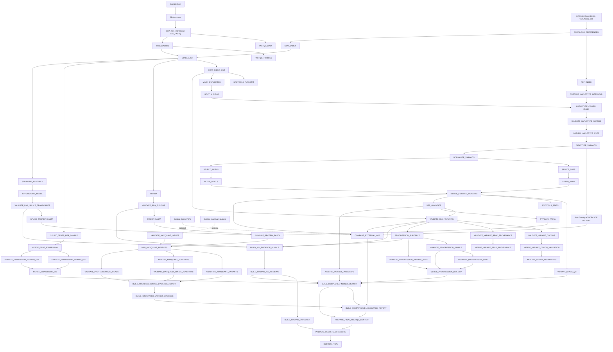

# PGTK Minimal Production Pipeline

PGTK is a production-oriented Nextflow DSL2 workflow for RNA-seq quality control, alignment, expression analysis, RNA-observed variant calling, fusion and splice analysis, longitudinal progression comparison, GO enrichment, exploratory proteogenomic FASTA generation, IGV evidence packaging, optional Sarek comparison, optional MaxQuant evidence integration, and consolidated reporting.

This README documents the complete source tree and the complete operating procedure from Git clone to final biological and browser-based review.

## Quickstart

Download [data](https://github.com/animesh/PGTK/blob/main/download_sra.sh)/[tools/assets](https://github.com/animesh/PGTK/blob/main/download_assets.sh) in DATA_ROOT, declare local WORK_ROOT and submit slurm job, for example:

```bash
git clone https://github.com/animesh/PGTK
cd PGTK
bash download_sra.sh
bash download_assets.sh
DATA_ROOT=$PWD
WORK_ROOT=/cluster/work/users/ash022
JOB_ID=$(sbatch --parsable \
  --account=nn9036k \
  scratch.slurm \
  --account nn9036k \
  --normal-partition normal \
  --bigmem-partition bigmem \
  --project-dir "$PWD" \
  --work-dir "$WORK_ROOT/pgtk-work" \
  --results-dir "$DATA_ROOT/results" \
  --reference-downloads "$DATA_ROOT/reference_downloads" \
  --container-cache "$DATA_ROOT/singularity_cache" \
  --sra-dir "$DATA_ROOT/sra_cache" \
  --tmp-root "$WORK_ROOT/pgtk-tmp" \
  --nxf-home "$DATA_ROOT/.nextflow_home" \
  --samplesheet "$DATA_ROOT/samples.csv" \
  --ensembl-pep "$DATA_ROOT/reference_downloads/Homo_sapiens.GRCh38.pep.all.fa.gz" \
  --pysam-image "$DATA_ROOT/singularity_cache/quay.io-biocontainers-pysam-0.24.0--py312hf5ad864_1.img" \
  --nextflow /cluster/home/ash022/bin/nextflow \
  --python /cluster/software/Mamba/4.14.0-0/bin/python3 \
  --apptainer /usr/bin/apptainer \
  --slurm-log-template "$PWD/pgtk-wrapper-{job_id}.log" \
  --)
printf '%s\n' "$JOB_ID" | tee .pgtk_current_job_id
echo "JOB_ID=$JOB_ID"
tail -f pgtk-wrapper-${JOB_ID}.log 
python3 tests/validate_published_findings.py   "$RESULTS/igv/findings/finding_explorer/partitions/all.jsonl.gz"   2>&1 | tee "$RESULTS/published_findings_validation-${JOB_ID}.log"
#published finding validation: PASS (157508 records)
```

## Interpretation limits

PGTK analyzes RNA-derived evidence. RNA-observed variants are not automatically DNA-confirmed somatic variants. RNA editing, allele-specific expression, germline variation, mapping ambiguity, transcript structure, library artifacts, and sequencing errors remain possible explanations. Predicted VEP impact describes the candidate allele and must not be interpreted as read-validation status.

PGTK does not execute Sarek or MaxQuant. Optional integration branches consume existing outputs from those tools.

## Validated production environment

```text
Workflow language: Nextflow DSL2
Nextflow reference version: 26.04.6
Scheduler: Slurm
Container runtime: Apptainer 1.4.4
Reference assembly: GRCh38
Ensembl release: 111
VEP cache: release 111, GRCh38
Pinned containers: 18
Required downloaded reference assets: 8
Processes in the current reference source: 74, discovered dynamically
```

Source and process counts are reported dynamically. They are not enforced as fixed constants.

## Pipeline architecture



## Core thresholds and defaults

All values can be overridden through Nextflow parameters unless noted otherwise.

### Variant calling and hard filters

| Parameter | Default | Meaning |
|---|---:|---|
| `haplotype_scatter_count` | 24 | HaplotypeCaller shards per sample. |
| `hc_calling_confidence` | 20 | GATK calling-confidence threshold. |
| `hc_dont_use_soft_clipped_bases` | true | Excludes soft-clipped bases from calling. |
| `hc_pcr_indel_model` | `CONSERVATIVE` | GATK PCR indel model. |
| `snp_filter_qd` | 2.0 | SNP QD lower threshold. |
| `snp_filter_fs` | 60.0 | SNP Fisher strand upper threshold. |
| `snp_filter_sor` | 3.0 | SNP SOR upper threshold. |
| `snp_filter_mq` | 40.0 | SNP mapping-quality lower threshold. |
| `snp_filter_mq_rank_sum` | -12.5 | SNP MQRankSum lower threshold. |
| `snp_filter_read_pos_rank_sum` | -8.0 | SNP ReadPosRankSum lower threshold. |
| `indel_filter_qd` | 2.0 | Indel QD lower threshold. |
| `indel_filter_fs` | 200.0 | Indel Fisher strand upper threshold. |
| `indel_filter_sor` | 10.0 | Indel SOR upper threshold. |
| `indel_filter_read_pos_rank_sum` | -20.0 | Indel ReadPosRankSum lower threshold. |

### RNA evidence and codons

| Parameter | Default | Meaning |
|---|---:|---|
| `rna_variant_min_depth` | 10 | Minimum RNA depth for a validated variant row. |
| `rna_variant_min_alt_reads` | 3 | Minimum exact ALT-supporting reads. |
| `rna_variant_min_alt_fraction` | 0.05 | Minimum ALT fraction among callable reads. |
| `rna_fusion_min_split_reads` | 1 | Minimum split-read support. |
| `rna_fusion_min_total_support` | 2 | Minimum split plus discordant support. |
| `read_validation_padding` | 150 bp | Read-validation locus padding. |
| Codon/read base quality | 20 | Default minimum base quality. |
| Codon/read mapping quality | 20 | Default minimum mapping quality. |

### Splice and fusion FASTAs

| Parameter | Default | Meaning |
|---|---:|---|
| `fusion_flank_aa` | 50 aa | Protein sequence retained around a fusion breakpoint. |
| `splice_min_coverage` | 2.5 | StringTie transcript coverage threshold. |
| `splice_min_junction_reads` | 3 | Minimum junction-read support. |
| `splice_min_isoform_fraction` | 0.05 | Minimum isoform fraction. |
| `splice_min_protein_aa` | 60 aa | Minimum translated splice-protein length. |
| `splice_class_codes` | `j,u` | GffCompare classes retained for novel splice processing. |

### Finding review and IGV

| Parameter | Default | Meaning |
|---|---:|---|
| `finding_review_mapq` | 20 | Minimum mapping quality for callable finding evidence. |
| `finding_review_baseq` | 20 | Minimum base quality for callable finding evidence. |
| `finding_review_reference_reads` | 20 | Reference-read display cap used by review generation. |
| `finding_classes` | RNA variant, progression variant, fusion, splice junction | Included candidate classes. |
| `finding_priority_mode` | `all` | Default priority selection mode. |
| `generate_priority_igv_reports` | true | Generates selected IGV reports. |
| `igv_report_max_reads` | 100 | Maximum reads passed to each report. |
| `igv_report_max_file_size_mb` | 64 MB | Per-report input-size protection. |
| `igv_report_timeout_seconds` | 600 s | Report-generation timeout. |

### GO and expression

| Parameter | Default | Meaning |
|---|---:|---|
| `go_min_size` | 10 | Minimum GO set size. |
| `go_max_size` | 500 | Maximum GO set size. |
| `go_fdr_threshold` | 0.1 | FDR threshold used for GO reporting. |
| `go_namespaces` | `all` | GO namespaces included. |
| `gene_count_feature_type` | `exon` | FeatureCounts feature type. |
| `gene_count_id_attribute` | `gene_id` | GTF identifier attribute. |
| `gene_count_strand` | 0 | Unstranded counting. |
| `gene_count_exclude_chimeric` | true | Excludes chimeric alignments. |
| `gene_count_primary_only` | true | Counts primary alignments only. |
| `gene_count_allow_multi_overlap` | false | Disallows multi-overlap assignment. |
| `gene_count_count_multimapping` | false | Excludes multimapping reads. |
| `expression_pseudocount` | 0.5 | Fold-change pseudocount. |
| `expression_cpm_threshold` | 1.0 | Expression CPM threshold. |
| `expression_tpm_threshold` | 0.0 | Expression TPM threshold. |
| `expression_rank_metric` | `log2_tpm_fold_change` | Metric for ranked GO analysis. |
| `expression_rank_min_nonzero_scores` | 1 | Minimum non-zero ranked scores. |

## Repository file guide

### Orchestration and configuration

| File | Purpose |
|---|---|
| `main.nf` | Complete 74-process DSL2 workflow, parameter defaults, process definitions, channel wiring, optional branches, publication, and report assembly. |
| `nextflow.config` | Slurm executor, Apptainer settings, queue routing, retries, per-process resources, and trace/report/timeline/DAG configuration. |
| `scratch.slurm` | Production wrapper. Resolves physical paths, builds the explicit bind contract, runs source and exact-container preflight, launches Nextflow with `-resume`, and writes failure/resource reports. |
| `run.sh` | Lightweight direct Nextflow launcher for non-production use. |
| `samples.csv` | Samplesheet with sample, SRA accession, subject, group, and baseline. |
| `multiqc_config.yaml` | MultiQC custom-content behavior and dashboard presentation. |
| `pipeline_required_files.txt` | Authoritative required-source manifest. |
| `PIPELINE_VALIDATION_SEMANTICS.md` | Definitions for validation states and evidence interpretation. |
| `VALIDATION_REPORT.md` | Recorded source and runtime validation scope. |
| `FILE_MANIFEST.tsv` | File sizes and SHA-256 values for the packaged source tree. |
| `.gitattributes` | Git file-attribute configuration. |
| `.gitignore` | Excludes generated work, results, assets, logs, and caches. |
| `.github/workflows/jekyll-gh-pages.yml` | GitHub Pages publication workflow. |
| `LICENSE` | Repository license. |

### Acquisition and environment validation

| File | Purpose |
|---|---|
| `download_assets.sh` | Downloads and checks the 18 pinned images and eight required reference assets. Run on a login node. |
| `download_sra.sh` | Downloads samplesheet SRA archives and validates each with `vdb-validate`. Run on a login node. |
| `validate_pipeline_commands.sh` | Dynamic source manifest, duplicate process, syntax, portability, wiring, Pysam contract, and `nextflow inspect` validation. |
| `validate_runtime_inputs.py` | Exact runtime check for directories, references, images, container executables, container-visible scripts, SRA archives, and optional inputs. |
| `tests/test_semantics.py` | SNV, MNV, insertion, deletion, and undefined-fraction semantic regressions. |
| `tests/test_container_bindings.py` | Regression test that explicit bind arguments are passed to container execution. |
| `tests/validate_published_findings.py` | Whole-explorer count, status, and undefined-fraction validator. |
| `collect_pipeline_failures.py` | Per-run failure ledger and cumulative history from trace, logs, attempts, and exit code. |
| `analyze_pipeline_trace.py` | Runtime, CPU, memory, retry, and efficiency summaries. |

### Variant and RNA evidence

| File | Purpose |
|---|---|
| `variant_read_evidence.py` | Shared normalized SNV, MNV, insertion, deletion, callable-reference, and exclusion classifier. |
| `validate_haplotype_shards.py` | Confirms every expected scattered GVCF shard is present and valid. |
| `summarize_variant_stages.py` | Counts raw, normalized, hard-filtered, PASS, VEP, and RNA-validated stages. |
| `validate_rna_events.py` | Sample-matched variant, fusion, and splice RNA support validation. |
| `validate_variant_codons.py` | Reference, VEP consequence, codon translation, and read-evidence validation. |
| `validate_variant_read_provenance.py` | ALT, clean-reference, excluded-read, callable-depth, MAPQ, base-quality, and ALT-fraction provenance. |
| `merge_variant_validation.py` | Consolidates per-sample validation tables. |
| `analyze_codon_mismatches.py` | Classifies and summarizes reference, alternate, transcript, and translation disagreements. |
| `build_integrated_variant_evidence.py` | Integrates variant, RNA, codon, provenance, and optional peptide evidence. |
| `compare_external_vcf.py` | Optional Sarek/external VCF comparison against raw, PASS, and RNA-validated PGTK stages. |
| `external_comparison.none.tsv` | Schema-valid sentinel used when external comparison is disabled. |

### Expression, progression, and GO

| File | Purpose |
|---|---|
| `prepare_go_annotations.py` | Converts OBO and GAF inputs into normalized annotation tables. |
| `expression_go_analysis.py` | Expression ORA and ranked GO analysis. |
| `analyze_progression_biology.py` | Per-sample progression allele, gene, and GO summaries. |
| `compare_progression_pair.py` | Pairwise non-baseline progression comparisons within subjects. |
| `merge_progression_biology.py` | Consolidates per-sample, pairwise, and set-level progression results. |
| `analyze_variant_landscape.py` | Variant classes, consequences, genes, and variant-associated GO summaries. |

### Proteogenomics and MaxQuant

| File | Purpose |
|---|---|
| `map_peptides_to_fasta.py` | Maps MaxQuant peptides to PGTK proteins, canonical FASTAs, and contaminants. |
| `annotate_variant_peptides.py` | Links peptides to variants, altered residues, annotations, and reference-proteome checks. |
| `analyze_chimeric_splice_peptides.py` | Fusion and novel-splice peptide classification. |
| `validate_splice_junction_peptides.py` | Sequence-level splice-junction peptide validation. |
| `validate_proteogenomic_reads.py` | Pysam-based read validation for peptide-linked genomic and transcript events. |
| `proteogenomics_evidence_report.py` | Integrated optional MaxQuant evidence report. |
| `maxquant_raw_file_map.none.tsv` | Schema-valid sentinel when no explicit raw-file map is supplied. |

### IGV, findings, dashboards, and reports

| File | Purpose |
|---|---|
| `build_igv_evidence_bundle.py` | BED/BEDPE coordinates, indexed event BAMs, IGV batches, sessions, and event-to-sample manifests. |
| `build_finding_igv_reviews.py` | Consolidates findings and builds exact-ALT, clean-reference, overlap, and browser-safe display BAMs. |
| `build_finding_explorer.py` | Portable database-free explorer, partitioned data, strict count invariants, and on-demand report server. |
| `serve_finding_explorer.sh` | Validates explorer resources and runs the generated server inside the IGV-reports image. |
| `report_legend.py` | Shared evidence and visualization legends. |
| `build_compact_multiqc_content.py` | Optional-branch and compact evidence sections. |
| `build_expression_multiqc_content.py` | Expression and GO dashboard sections. |
| `build_pgtk_multiqc_content.py` | Main variant, progression, priority-candidate, and navigation sections. |
| `build_results_catalogue.py` | Discovers published results and produces documented result-family links. |
| `build_complete_report.py` | Complete cross-branch findings report. |
| `build_comparative_advantage_report.py` | Comparative interpretation report with branch availability. |

## Complete operating procedure

### 1. Clone or enter the source checkout

```bash
export PGTK_INSTALL_PARENT="${PGTK_INSTALL_PARENT:?Set the installation parent directory}"
export PGTK_REPOSITORY_URL="${PGTK_REPOSITORY_URL:?Set the repository URL}"
export PGTK_SOURCE_NAME="${PGTK_SOURCE_NAME:-PGTK}"

cd "$PGTK_INSTALL_PARENT"
git clone "$PGTK_REPOSITORY_URL" "$PGTK_SOURCE_NAME"
cd "$PGTK_SOURCE_NAME"
export PGTK_PROJECT_DIR="$(pwd -P)"
```

### 2. Configure runtime roots

```bash
export PGTK_DATA_ROOT="${PGTK_DATA_ROOT:?Set shared assets and results root}"
export PGTK_WORK_ROOT="${PGTK_WORK_ROOT:?Set writable work root}"

export PGTK_WORK_DIR="${PGTK_WORK_DIR:-$PGTK_WORK_ROOT/pgtk-work}"
export PGTK_TMP_ROOT="${PGTK_TMP_ROOT:-$PGTK_WORK_ROOT/pgtk-tmp}"
export PGTK_RESULTS_DIR="${PGTK_RESULTS_DIR:-$PGTK_DATA_ROOT/results}"
export PGTK_REFERENCE_DOWNLOADS="${PGTK_REFERENCE_DOWNLOADS:-$PGTK_DATA_ROOT/reference_downloads}"
export PGTK_CONTAINER_CACHE="${PGTK_CONTAINER_CACHE:-$PGTK_DATA_ROOT/singularity_cache}"
export PGTK_SRA_DIR="${PGTK_SRA_DIR:-$PGTK_DATA_ROOT/sra_cache}"
export PGTK_NXF_HOME="${PGTK_NXF_HOME:-$PGTK_DATA_ROOT/.nextflow_home}"
export PGTK_SAMPLESHEET="${PGTK_SAMPLESHEET:-$PGTK_DATA_ROOT/samples.csv}"

export PGTK_NEXTFLOW="${PGTK_NEXTFLOW:-$(command -v nextflow)}"
export PGTK_PYTHON="${PGTK_PYTHON:-$(command -v python3)}"
export PGTK_APPTAINER="${PGTK_APPTAINER:-$(command -v apptainer)}"
export PGTK_PYSAM_IMAGE="${PGTK_PYSAM_IMAGE:-$PGTK_CONTAINER_CACHE/quay.io-biocontainers-pysam-0.24.0--py312hf5ad864_1.img}"
export PGTK_ENSEMBL_PEP="${PGTK_ENSEMBL_PEP:-$PGTK_REFERENCE_DOWNLOADS/Homo_sapiens.GRCh38.pep.all.fa.gz}"

export PGTK_ACCOUNT="${PGTK_ACCOUNT:?Set Slurm account}"
export PGTK_NORMAL_PARTITION="${PGTK_NORMAL_PARTITION:?Set normal partition}"
export PGTK_BIGMEM_PARTITION="${PGTK_BIGMEM_PARTITION:?Set big-memory partition}"
export PGTK_SLURM_LOG_TEMPLATE="${PGTK_SLURM_LOG_TEMPLATE:-$PGTK_PROJECT_DIR/pgtk-wrapper-{job_id}.log}"
```

### 3. Configure and check the samplesheet

Use:

```csv
sample,srr,TK,Group,baseline
SAMPLE_A,SRR000001,SUBJECT_1,baseline_group,true
SAMPLE_B,SRR000002,SUBJECT_1,followup_group,false
```

Exactly one baseline enables subtraction for a subject. No baseline is reported and skipped. Multiple baselines are an error. Per-sample FASTAs remain independent from subtraction.

### 4. Download assets and SRA archives

Run on a login node, never on an internet-restricted compute node:

```bash
cd "$PGTK_PROJECT_DIR"
bash download_assets.sh "$PGTK_PROJECT_DIR" 2>&1 | tee "download_assets_$(date +%Y%m%d_%H%M%S).log"
bash download_sra.sh "$PGTK_PROJECT_DIR" 2>&1 | tee "download_sra_$(date +%Y%m%d_%H%M%S).log"
```

Verify generated checksum files and `vdb-validate` results.

### 5. Preserve resume history when changing checkout

A work directory alone does not enable resume. Copy the previous `.nextflow` metadata:

```bash
export PGTK_PREVIOUS_PROJECT="${PGTK_PREVIOUS_PROJECT:?Set previous source checkout}"

test -d "$PGTK_PREVIOUS_PROJECT/.nextflow"
test -d "$PGTK_WORK_DIR"
mkdir -p "$PGTK_PROJECT_DIR/.nextflow"
rsync -a "$PGTK_PREVIOUS_PROJECT/.nextflow/" "$PGTK_PROJECT_DIR/.nextflow/"

cd "$PGTK_PROJECT_DIR"
"$PGTK_NEXTFLOW" log | tail -20
```

If Nextflow says `Option -resume is ignored`, stop the job and restore the correct history. Do not run `nextflow clean`.

### 6. Validate source

```bash
cd "$PGTK_PROJECT_DIR"
python3 tests/test_semantics.py
python3 tests/test_container_bindings.py
bash validate_pipeline_commands.sh \
  --project-dir "$PGTK_PROJECT_DIR" \
  --nextflow "$PGTK_NEXTFLOW" \
  --python "$PGTK_PYTHON"
```

Required ending:

```text
PASS  Shared explicit Apptainer bind contract wired
PASS  Runtime container visibility validation wired
FAIL: 0
RESULT: PASSED
```

### 7. Run exact preflight-only job

```bash
cd "$PGTK_PROJECT_DIR"
PREFLIGHT_JOB=$(sbatch --parsable \
  --account="$PGTK_ACCOUNT" \
  scratch.slurm \
  --preflight-only \
  --account "$PGTK_ACCOUNT" \
  --normal-partition "$PGTK_NORMAL_PARTITION" \
  --bigmem-partition "$PGTK_BIGMEM_PARTITION" \
  --project-dir "$PGTK_PROJECT_DIR" \
  --work-dir "$PGTK_WORK_DIR" \
  --results-dir "$PGTK_RESULTS_DIR" \
  --reference-downloads "$PGTK_REFERENCE_DOWNLOADS" \
  --container-cache "$PGTK_CONTAINER_CACHE" \
  --sra-dir "$PGTK_SRA_DIR" \
  --tmp-root "$PGTK_TMP_ROOT" \
  --nxf-home "$PGTK_NXF_HOME" \
  --samplesheet "$PGTK_SAMPLESHEET" \
  --ensembl-pep "$PGTK_ENSEMBL_PEP" \
  --pysam-image "$PGTK_PYSAM_IMAGE" \
  --nextflow "$PGTK_NEXTFLOW" \
  --python "$PGTK_PYTHON" \
  --apptainer "$PGTK_APPTAINER" \
  --slurm-log-template "$PGTK_SLURM_LOG_TEMPLATE" \
  -- \
  --run_external_vcf_comparison false \
  --run_proteogenomic_validation false
)
```

Required ending:

```text
PASS  Pysam container: configured paths visible
PASS: COMPLETE PRE-SUBMISSION RUNTIME VALIDATION
PASS: preflight-only mode completed; Nextflow was not launched
```

### 8. Submit production run

Use the same command without `--preflight-only`:

```bash
JOB_ID=$(sbatch --parsable \
  --account="$PGTK_ACCOUNT" \
  scratch.slurm \
  --account "$PGTK_ACCOUNT" \
  --normal-partition "$PGTK_NORMAL_PARTITION" \
  --bigmem-partition "$PGTK_BIGMEM_PARTITION" \
  --project-dir "$PGTK_PROJECT_DIR" \
  --work-dir "$PGTK_WORK_DIR" \
  --results-dir "$PGTK_RESULTS_DIR" \
  --reference-downloads "$PGTK_REFERENCE_DOWNLOADS" \
  --container-cache "$PGTK_CONTAINER_CACHE" \
  --sra-dir "$PGTK_SRA_DIR" \
  --tmp-root "$PGTK_TMP_ROOT" \
  --nxf-home "$PGTK_NXF_HOME" \
  --samplesheet "$PGTK_SAMPLESHEET" \
  --ensembl-pep "$PGTK_ENSEMBL_PEP" \
  --pysam-image "$PGTK_PYSAM_IMAGE" \
  --nextflow "$PGTK_NEXTFLOW" \
  --python "$PGTK_PYTHON" \
  --apptainer "$PGTK_APPTAINER" \
  --slurm-log-template "$PGTK_SLURM_LOG_TEMPLATE" \
  -- \
  --run_external_vcf_comparison false \
  --run_proteogenomic_validation false
)
printf '%s\n' "$JOB_ID" | tee .pgtk_current_job_id
```

### 9. Monitor

```bash
LOG=${PGTK_SLURM_LOG_TEMPLATE//\{job_id\}/$JOB_ID}
tail -F "$LOG"
squeue -j "$JOB_ID" -o '%.18i %.12P %.35j %.10T %.10M %.10l %R'
```

## Optional Sarek evaluation

PGTK expects exactly one indexed VCF per samplesheet SRA accession, found recursively as `<SRR><suffix>`.

```bash
export PGTK_EXTERNAL_VCF_DIR="${PGTK_EXTERNAL_VCF_DIR:?Set Sarek VCF root}"
export PGTK_EXTERNAL_VCF_SUFFIX="${PGTK_EXTERNAL_VCF_SUFFIX:-.haplotypecaller.filtered.vcf.gz}"
```

Add before the wrapper separator:

```bash
--bind-path "$PGTK_EXTERNAL_VCF_DIR"
```

Add after the wrapper separator:

```bash
--run_external_vcf_comparison true \
--external_vcf_dir "$PGTK_EXTERNAL_VCF_DIR" \
--external_vcf_suffix "$PGTK_EXTERNAL_VCF_SUFFIX"
```

First run with `--preflight-only`, then submit the same command without it. Results are under `results/comparison/external_vcf/` and compare raw, PASS, and RNA-validated PGTK calls.

## Optional MaxQuant evaluation

1. Run PGTK with proteogenomic validation disabled.
2. Use sample FASTAs from `results/combined_fasta/` in MaxQuant.
3. Run MaxQuant externally.
4. Resume PGTK with validation enabled.

Required MaxQuant files:

```text
peptides.txt
evidence.txt
msms.txt
proteinGroups.txt
mqpar.xml
contaminants FASTA
```

Configure:

```bash
export PGTK_MAXQUANT_TXT="${PGTK_MAXQUANT_TXT:?Set MaxQuant txt directory}"
export PGTK_MAXQUANT_MQPAR="${PGTK_MAXQUANT_MQPAR:?Set mqpar.xml}"
export PGTK_MAXQUANT_CONTAMINANTS="${PGTK_MAXQUANT_CONTAMINANTS:?Set contaminants FASTA}"
export PGTK_MAXQUANT_RAW_MAP="${PGTK_MAXQUANT_RAW_MAP:-}"
```

Add required bind roots before the separator:

```bash
--bind-path "$PGTK_MAXQUANT_TXT" \
--bind-path "$(dirname "$PGTK_MAXQUANT_MQPAR")" \
--bind-path "$(dirname "$PGTK_MAXQUANT_CONTAMINANTS")"
```

Add after the separator:

```bash
--run_proteogenomic_validation true \
--maxquant_txt "$PGTK_MAXQUANT_TXT" \
--maxquant_mqpar "$PGTK_MAXQUANT_MQPAR" \
--maxquant_contaminants "$PGTK_MAXQUANT_CONTAMINANTS" \
--ensembl_pep "$PGTK_ENSEMBL_PEP"
```

If supplied, also pass `--maxquant_raw_map "$PGTK_MAXQUANT_RAW_MAP"`. Preflight first, then resume. Results are under `results/proteogenomics_validation/`.

## Post-run checks

```bash
JOB_ID=$(cat "$PGTK_PROJECT_DIR/.pgtk_current_job_id")
TRACE="$PGTK_RESULTS_DIR/pipeline_trace-${JOB_ID}.tsv"
awk -F '\t' 'NR==1 || ($7!="COMPLETED" && $7!="CACHED")' "$TRACE"
cat "$PGTK_RESULTS_DIR/failure_logs/$JOB_ID/run_summary.json"
cat "$PGTK_RESULTS_DIR/failure_logs/$JOB_ID/failure_ledger.tsv"
python3 "$PGTK_PROJECT_DIR/tests/validate_published_findings.py" \
  "$PGTK_RESULTS_DIR/igv/findings/finding_explorer/partitions/all.jsonl.gz"
```

The trace should print only the header, the final exit code should be zero, the failure ledger should contain only its header, and the findings validator should pass.

## Run the IGV finding server

This is the complete server command:

```bash
export PGTK_IGV_REPORTS_IMAGE="$PGTK_CONTAINER_CACHE/quay.io-biocontainers-igv-reports-1.16.0--pyh7e72e81_0.img"
export PGTK_IGV_GENOME="${PGTK_IGV_GENOME:-$PGTK_REFERENCE_DOWNLOADS/Homo_sapiens.GRCh38.dna.primary_assembly.fa}"
export PGTK_EXPLORER_PORT="${PGTK_EXPLORER_PORT:-8765}"

EXPLORER_DIR="$PGTK_RESULTS_DIR/igv/findings/finding_explorer"
rm -rf "$EXPLORER_DIR/report_cache"

bash "$PGTK_PROJECT_DIR/serve_finding_explorer.sh" \
  "$EXPLORER_DIR" \
  "$PGTK_EXPLORER_PORT"
```

From the local computer:

```bash
export PGTK_REMOTE_LOGIN="${PGTK_REMOTE_LOGIN:?Set user@login-host}"
ssh -N -L \
  "${PGTK_EXPLORER_PORT}:127.0.0.1:${PGTK_EXPLORER_PORT}" \
  "$PGTK_REMOTE_LOGIN"
```

Open `http://127.0.0.1:<port>/`.

Test representative SNVs, MNVs, insertions, deletions, no-callable findings, low-callable-fraction findings, fusions, splice events, progression events, and MaxQuant-linked events when enabled. HTTP 200 proves HTML delivery only. Confirm that IGV renders without missing tracks or JavaScript errors.

## Evidence interpretation

```text
CallableAlignments = ExactAltReads + CleanReferenceReads
UniqueAlignments = CallableAlignments + ExcludedReads
ALT fraction among callable = ExactAltReads / CallableAlignments
Callable fraction among examined = CallableAlignments / UniqueAlignments
```

When callable depth is zero, ALT fraction must be `NA` or null. Overlap alone is not ALT evidence.

## Principal output locations

```text
results/qc/
results/bam/star/
results/gvcf/
results/vcf_raw/
results/vcf_normalized/
results/vcf_snp/
results/vcf_indel/
results/vcf_filtered/
results/vcf_pass/
results/vep/
results/rna_validation/
results/progression_vcf/
results/progression_biology/
results/expression/
results/variant_landscape/
results/combined_fasta/
results/igv/
results/reports/
results/comparison/external_vcf/
results/proteogenomics_validation/
results/comparative_advantage/
results/multiqc/
results/failure_logs/
```

## Common failures

- `Option -resume is ignored`: restore the previous `.nextflow` history and resubmit.
- Container cannot open a project script: inspect the explicit bind contract; do not use a broad site-wide bind.
- `--slurm-log-template must contain {job_id}`: retain the literal placeholder.
- Too many reruns: compare physical source path, scripts, inputs, parameters, containers, work directory, and run history.
- Sarek preflight finds zero or multiple files: require exactly one `<SRR><suffix>` and `.tbi` per accession.
- MaxQuant preflight fails: verify four tables, `mqpar.xml`, canonical FASTA paths, contaminants, raw mapping, and bind roots.
- Explorer HTTP 500 for missing BAM: use the project-level launcher and keep sibling `finding_reviews` with `finding_explorer`.
- Browser `reading del`: regenerate current browser-safe display BAMs, clear report cache, restart, and hard-refresh.
- BAM index older than BAM: rebuild the index after the final BAM write.
- A biological `failed.tsv` is not a task failure. Use trace, exit code, wrapper log, and failure ledger.

## Release checklist

```text
Source validation passes
Binding regression passes
Preflight-only job passes
Production exit code is zero
Trace contains only COMPLETED and CACHED
Failure ledger contains only header
Whole findings validator passes
Representative IGV reports render
Sarek outputs checked when enabled
MaxQuant outputs checked when enabled
MultiQC dashboard and Results catalogue open
```

## License

See `LICENSE`.
